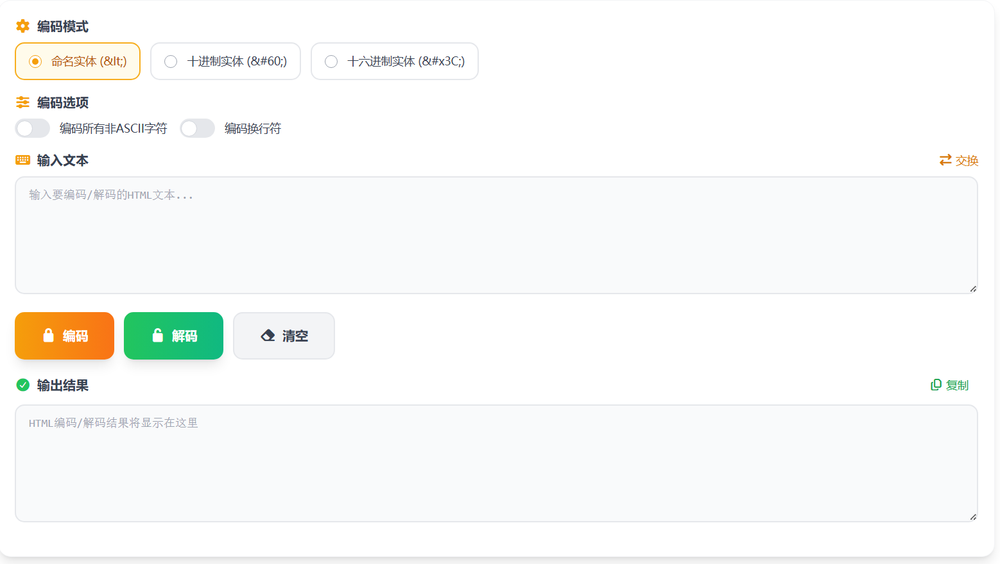

# HTML编码/解码 核心JS实现

这篇只讲本项目里 HTML 编码/解码工具的核心 JavaScript 实现，重点是编码规则、解码逻辑和交互动作如何串起来。

> 在线工具网址：[https://see-tool.com/html-encoder](https://see-tool.com/html-encoder)  
> 工具截图：  
> 

## 1）状态与模式

工具的核心状态很直接：输入、输出、编码模式、是否全量编码、是否编码换行。

```js
const inputText = ref('')
const outputText = ref('')
const encodingMode = ref('named') // named | decimal | hex
const encodeAll = ref(false)
const encodeNewlines = ref(false)
```

这几个状态决定了全部行为：

- `encodingMode` 控制输出实体格式（命名实体、十进制实体、十六进制实体）
- `encodeAll` 控制是否只编码基础危险字符，还是扩展到更多字符
- `encodeNewlines` 控制 `\n` / `\r` 是否转换为实体

## 2）实体映射：命名实体的基础表

命名模式需要一张字符到实体的映射表，基础字符和常见符号都在其中。

```js
const namedEntities = {
  '&': '&amp;',
  '<': '&lt;',
  '>': '&gt;',
  '"': '&quot;',
  "'": '&apos;',
  ' ': '&nbsp;',
  '©': '&copy;',
  '®': '&reg;',
  '™': '&trade;'
}

const basicChars = ['&', '<', '>', '"', "'"]
```

这里 `basicChars` 很关键：不管用户有没有开启“全量编码”，这几个字符都要优先转义。

## 3）单字符编码：统一出口 `encodeChar`

单字符编码被集中在一个函数里，避免分散判断。

```js
const encodeChar = (char, mode) => {
  const code = char.charCodeAt(0)

  if (mode === 'named' && namedEntities[char]) {
    return namedEntities[char]
  } else if (mode === 'decimal') {
    return '&#' + code + ';'
  } else if (mode === 'hex') {
    return '&#x' + code.toString(16).toUpperCase() + ';'
  }

  return '&#' + code + ';'
}
```

这段逻辑的好处是：

- 三种编码模式都走同一个出口
- 命名实体查不到时自动回退到数值实体
- 十六进制统一大写，结果更稳定

## 4）是否需要编码：`shouldEncode`

编码前先判断字符是否应被处理。

```js
const shouldEncode = (char, encodeAllFlag) => {
  if (basicChars.includes(char)) return true

  if (encodeAllFlag) {
    const code = char.charCodeAt(0)
    return code > 127 || namedEntities[char]
  }

  return false
}
```

规则非常明确：

- 默认只处理基础字符
- 打开全量编码后，再处理非 ASCII 字符和映射表内字符

## 5）主编码流程：逐字符扫描 `htmlEncode`

主流程采用逐字符遍历，便于精细控制换行和实体转换。

```js
const htmlEncode = (text, mode, encodeAllFlag, encodeNewlinesFlag) => {
  let result = ''

  for (let i = 0; i < text.length; i++) {
    const char = text[i]

    if (char === '\n') {
      result += encodeNewlinesFlag ? '&#10;' : char
      continue
    }
    if (char === '\r') {
      result += encodeNewlinesFlag ? '&#13;' : char
      continue
    }

    result += shouldEncode(char, encodeAllFlag)
      ? encodeChar(char, mode)
      : char
  }

  return result
}
```

这里把“换行实体化”作为独立分支，避免和普通字符逻辑混在一起。

## 6）解码流程：利用浏览器原生能力

解码实现没有手写完整解析器，而是直接借助浏览器对实体的原生解析。

```js
const htmlDecode = (text) => {
  const textarea = document.createElement('textarea')
  textarea.innerHTML = text
  return textarea.value
}
```

这样可以同时处理命名实体、十进制实体和十六进制实体，代码量很小，行为也一致。

## 7）动作函数：编码、解码、交换、清空、复制

工具的交互动作都由独立函数管理。

编码与解码入口：

```js
const handleEncode = () => {
  if (!inputText.value.trim()) return
  outputText.value = htmlEncode(
    inputText.value,
    encodingMode.value,
    encodeAll.value,
    encodeNewlines.value
  )
}

const handleDecode = () => {
  if (!inputText.value.trim()) return
  outputText.value = htmlDecode(inputText.value)
}
```

交换输入输出：

```js
const swapInputOutput = () => {
  const temp = inputText.value
  inputText.value = outputText.value
  outputText.value = temp
}
```

复制结果（现代 API + 兼容兜底）：

```js
const copyResult = async () => {
  if (!outputText.value.trim()) return

  try {
    await navigator.clipboard.writeText(outputText.value)
  } catch {
    const textarea = document.createElement('textarea')
    textarea.value = outputText.value
    document.body.appendChild(textarea)
    textarea.select()
    document.execCommand('copy')
    document.body.removeChild(textarea)
  }
}
```

这部分让工具在真实使用中具备完整闭环：输入 -> 转换 -> 复制/反向处理。

## 8）实现小结

本工具的核心 JS 可以归纳为四层：

1. 状态层：输入输出与编码选项
2. 规则层：实体映射与编码判定
3. 转换层：`htmlEncode` 与 `htmlDecode`
4. 动作层：编码、解码、交换、清空、复制

整体实现没有依赖第三方编码库，完全基于浏览器原生能力和 Vue 响应式状态完成，逻辑清晰，维护成本也低。
