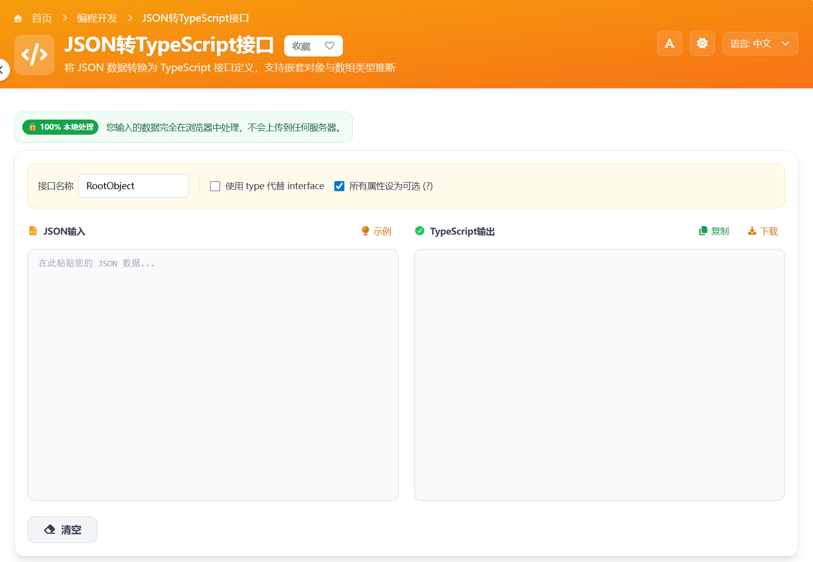

# JSON转TypeScript接口 在线工具分享

做前端或全栈开发时，经常会遇到这样的情况：后端已经返回了 JSON 数据，但我们还要手动写 TypeScript 接口，既花时间又容易漏字段。这个工具就是为这个痛点准备的。

我把它做成了一个在线小工具，核心前端使用 **Vue** 开发。你只要把 JSON 粘贴进去，就能一键生成对应的 TypeScript 接口代码，适合日常接口联调和项目初始化。

> 在线工具网址：[https://see-tool.com/json-to-typescript](https://see-tool.com/json-to-typescript)  
> 工具截图：  
> 

## 这个工具能帮你做什么

- 自动把 JSON 转成 TypeScript interface
- 支持对象嵌套、数组结构等常见数据格式
- 减少手写接口出错，提升开发效率
- 在线即用，不需要安装额外软件

## 使用步骤

1. 复制接口返回的 JSON 数据
2. 打开 JSON转TypeScript接口 工具页面
3. 把 JSON 粘贴到输入区域
4. 点击生成，右侧会输出 TypeScript 接口
5. 复制代码到你的 Vue/TS 项目中使用

## 适合哪些人

- 刚接触 TypeScript 的前端同学
- 需要快速搭建数据类型的 Vue 项目开发者
- 经常做接口对接、希望减少重复劳动的工程师

如果你平时也觉得“写接口定义很机械”，这个工具会明显省时。先把数据跑通，再根据业务微调类型，会更高效。
