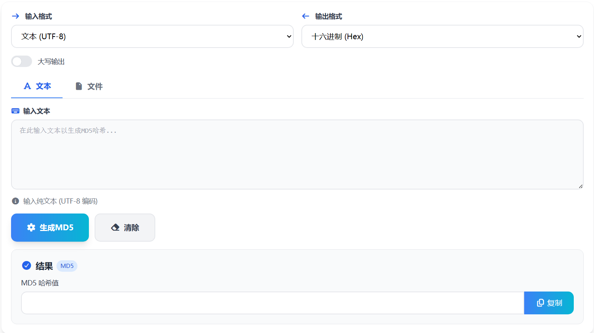

# MD5在线加密 核心JS实现

这篇只讲本工具的核心 JavaScript：把“文本/文件”统一转换成字节序列，计算 MD5，再按用户选择的格式输出。

> 在线工具网址：[https://see-tool.com/md5-encryptor](https://see-tool.com/md5-encryptor)  
> 工具截图：  
> 

## 1）整体数据流：输入 -> 字节 -> MD5 -> 输出

工具的主流程可以概括成四步：

1. 根据输入格式把内容解析成 `Uint8Array`
2. 使用增量 MD5 计算器得到 32 位十六进制摘要字符串
3. 把十六进制摘要再转换回字节（统一到同一套输出格式化）
4. 按 `hex / hex-space / base64` 输出，并可选大写

核心原因是：无论输入来自文本还是文件，最终都要落到“字节”这个中间态，才能保证行为一致。

## 2）输入解析：`parseInput(text, format)`

输入格式支持 `text / base64 / hex / hex-space`，解析函数的目标是：返回一个“要参与 MD5 的字节数组”。

### 2.1 文本：`TextEncoder` 直接转 UTF-8 字节

```js
case 'text':
  return new TextEncoder().encode(text)
```

这里把字符串编码为 UTF-8 字节，确保中文、Emoji 等多字节字符也能稳定计算。

### 2.2 Base64：`atob` 还原字节

```js
case 'base64': {
  const binaryString = atob(text.replace(/\s/g, ''))
  const bytes = new Uint8Array(binaryString.length)
  for (let i = 0; i < binaryString.length; i++) {
    bytes[i] = binaryString.charCodeAt(i)
  }
  return bytes
}
```

关键点：Base64 输入会先清理空白字符，兼容多行粘贴；`atob` 的结果是“单字节字符串”，需要逐字节转为 `Uint8Array`。

### 2.3 Hex：去空白 + 校验 + 每两位转一个字节

```js
case 'hex': {
  const hex = text.replace(/\s/g, '')
  if (!/^[0-9a-fA-F]*$/.test(hex)) {
    throw new Error('invalid hex')
  }
  const bytes = new Uint8Array(hex.length / 2)
  for (let i = 0; i < hex.length; i += 2) {
    bytes[i / 2] = parseInt(hex.substr(i, 2), 16)
  }
  return bytes
}
```

这段实现把十六进制视为“连续的字节流”，中间允许插入空格/换行；只要字符集不在 `[0-9a-fA-F]` 就直接判错。

### 2.4 Hex(空格分隔)：按 token 解析

```js
case 'hex-space': {
  const parts = text.trim().split(/\s+/)
  const bytesArray = new Uint8Array(parts.length)
  for (let i = 0; i < parts.length; i++) {
    if (!/^[0-9a-fA-F]{1,2}$/.test(parts[i])) {
      throw new Error('invalid hex token')
    }
    bytesArray[i] = parseInt(parts[i], 16)
  }
  return bytesArray
}
```

这种格式适合处理“每个字节之间用空格分隔”的数据（例如抓包或调试输出）。每个 token 允许 1~2 位十六进制。

## 3）MD5 计算：统一用 `SparkMD5.ArrayBuffer`

工具用 `spark-md5` 做 MD5 计算。它的 `ArrayBuffer` 版本支持“追加数据”计算，既能处理文本输入，也能用于文件分片。

### 3.1 文本模式：`Uint8Array` 直接参与计算

```js
const calculateMD5 = (bytes) => {
  const spark = new SparkMD5.ArrayBuffer()
  spark.append(bytes)
  const hashHex = spark.end()
  return hexToBytes(hashHex)
}
```

实现里会把最终的 `hashHex` 再转回字节数组，目的是把“输出格式化”统一为对字节数组操作（hex、base64 都能复用同一套逻辑）。

### 3.2 十六进制摘要转字节：`hexToBytes`

```js
const hexToBytes = (hex) => {
  const bytes = new Uint8Array(hex.length / 2)
  for (let i = 0; i < hex.length; i += 2) {
    bytes[i / 2] = parseInt(hex.substr(i, 2), 16)
  }
  return bytes
}
```

MD5 的摘要是 16 字节（32 个十六进制字符），转换后就是固定长度的 `Uint8Array(16)`。

## 4）输出格式化：`formatOutput(bytes, format)`

输出支持：

- `hex`：连续 32 位十六进制
- `hex-space`：每个字节用空格分隔
- `base64`：对 16 字节摘要做 Base64

### 4.1 先把字节拼成十六进制串

```js
const hexString = Array.from(bytes)
  .map(b => b.toString(16).padStart(2, '0'))
  .join('')
```

有了 `hexString`，`hex` 与 `hex-space` 都只是在展示层做不同分割。

### 4.2 `hex` 与大写开关

```js
case 'hex':
  return uppercase.value ? hexString.toUpperCase() : hexString
```

### 4.3 `hex-space`：每两位插空格

```js
case 'hex-space': {
  const hex = uppercase.value ? hexString.toUpperCase() : hexString
  return hex.match(/.{2}/g).join(' ')
}
```

### 4.4 `base64`：字节转“单字节字符串”再 `btoa`

```js
case 'base64': {
  const binaryString = String.fromCharCode.apply(null, bytes)
  return btoa(binaryString)
}
```

这里的 Base64 输出是“对 MD5 摘要（16 字节）”编码后的结果。

## 5）文件模式：分片读取 + 增量追加

文件模式的核心是：用 `FileReader.readAsArrayBuffer` 读取文件切片，并把每一片追加到同一个 `SparkMD5.ArrayBuffer()` 实例中。

```js
const processFile = (file) => {
  fileProgress.value = 0
  const reader = new FileReader()
  const chunkSize = 2 * 1024 * 1024
  let offset = 0
  const spark = new SparkMD5.ArrayBuffer()

  const readNextChunk = () => {
    const slice = file.slice(offset, offset + chunkSize)
    reader.readAsArrayBuffer(slice)
  }

  reader.onload = (e) => {
    const arrayBuffer = e.target.result
    spark.append(arrayBuffer)

    offset += arrayBuffer.byteLength
    fileProgress.value = Math.round((offset / file.size) * 100)

    if (offset < file.size) {
      readNextChunk()
    } else {
      const hashHex = spark.end()
      const hashBytes = hexToBytes(hashHex)
      hashResult.value = formatOutput(hashBytes, outputFormat.value)
      fileProgress.value = 0
    }
  }

  reader.onerror = () => {
    fileProgress.value = 0
  }

  readNextChunk()
}
```

这段逻辑只做三件事：

1. 读取切片得到 `ArrayBuffer`
2. 追加到 `spark`
3. 读完后统一走 `formatOutput` 输出

进度条的百分比来自 `offset / file.size` 的比例计算。

## 6）入口调度：`generateHash()` 把两种模式收口

工具的“生成”按钮只需要根据当前 tab 分流：

```js
const generateHash = () => {
  if (activeTab.value === 'file') {
    if (!selectedFile) return
    processFile(selectedFile)
    return
  }

  if (!inputText.value) return

  const bytes = parseInput(inputText.value, inputFormat.value)
  const hashBytes = calculateMD5(bytes)
  hashResult.value = formatOutput(hashBytes, outputFormat.value)
}
```

到这里，文本与文件的差异只剩下“如何拿到输入字节”，后续的 MD5 计算与输出格式化完全复用同一套函数。
