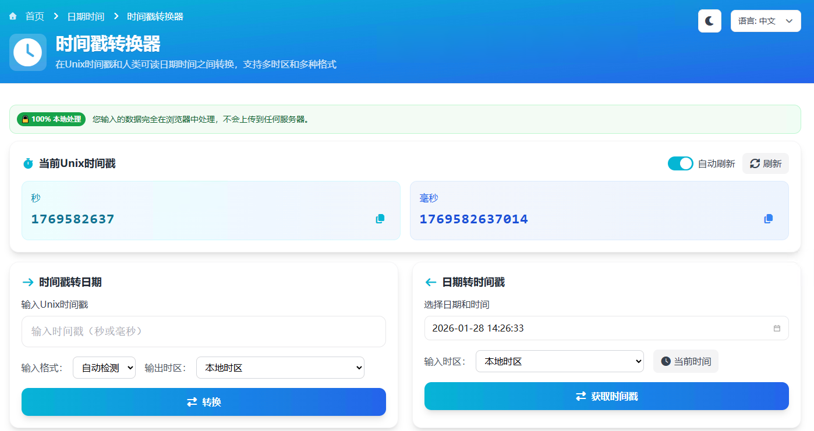

## 工具介绍

今天分享一个我用 **Vue3** 开发的实用工具——**时间戳转换器**。它能快速完成时间戳与日期之间的转换，支持多时区、智能检测格式，完全免费且保护隐私。

> 在线工具网址：[https://see-tool.com/timestamp-converter](https://see-tool.com/timestamp-converter)

> 工具截图：

## 什么是时间戳？

**时间戳**是从 1970年1月1日 00:00:00 UTC 开始计算的秒数或毫秒数，是计算机表示时间的标准方式。

- **秒级**: `1706425716` (10位数字)
- **毫秒级**: `1706425716000` (13位数字)

时间戳全球统一、便于计算，但人类难以直接理解，因此需要转换工具。

## 核心功能

### 1. 实时时间戳显示 ⏰

页面顶部实时显示当前的秒级和毫秒级时间戳，每秒自动更新，支持一键复制。适合快速获取当前时间戳用于测试或记录。

### 2. 时间戳转日期 📅

输入时间戳，自动转换为可读的日期时间，提供：
- 本地时间、UTC 时间、ISO 8601 格式
- 相对时间（如"3天前"）
- 星期几、年中第几天、第几周

支持自动检测秒级/毫秒级格式，可选择不同时区显示。

### 3. 日期转时间戳 🔄

选择日期时间，快速获取对应的秒级和毫秒级时间戳。支持选择输入时区，确保转换准确。

## 特色亮点

- 🌍 **多时区支持**: 覆盖全球主要时区（中国、日本、美国、欧洲等）
- 🔍 **智能检测**: 自动识别时间戳格式
- 🌐 **双语界面**: 中英文切换
- 📱 **响应式设计**: 支持电脑、平板、手机
- 🔒 **隐私安全**: 本地计算，不上传数据
- ⚡ **快速响应**: Vue3 技术栈，性能优秀

## 使用场景

1. **查看日志**: 日志中的时间戳转换为可读时间
2. **数据分析**: 数据库导出的时间戳批量理解
3. **API 测试**: 快速获取测试用的时间戳参数
4. **跨时区协作**: 转换不同时区的时间，避免混乱

## 技术实现

工具采用现代化前端技术栈：
- **框架**: Vue 3 + Nuxt 3
- **UI 组件**: TDesign Vue Next
- **样式**: Tailwind CSS
- **国际化**: Vue I18n

所有计算在浏览器本地完成，不会上传任何数据到服务器，保证隐私安全。

## 使用小技巧

1. **快速复制**: 每个结果旁都有复制按钮
2. **自动刷新**: 可关闭实时更新，手动刷新
3. **当前时间**: 点击"当前时间"按钮快速填入
4. **格式检测**: 不确定格式时选择"自动检测"

## 常见问题

**Q: 时间戳会受时区影响吗？**  
A: 不会！时间戳基于 UTC，全球统一。同一时刻在不同时区显示不同，但时间戳相同。

**Q: 为什么转换结果不对？**  
A: 检查是否混淆了秒级和毫秒级（相差1000倍），或时区设置不正确。

**Q: 工具会保存我的数据吗？**  
A: 完全不会！所有计算在本地完成，不上传任何数据。

## 结语

时间戳转换器是开发者和数据工作者的必备工具。我用 Vue3 开发这个工具，希望能帮助更多人高效处理时间数据。工具完全免费、无广告、保护隐私，欢迎使用和分享！

---

**技术栈**: Vue 3 + Nuxt 3 + TDesign + Tailwind CSS  
**特点**: 多时区 | 智能检测 | 双语支持 | 隐私安全  
**开发**: 个人开发，持续维护中

感谢使用！🎉

