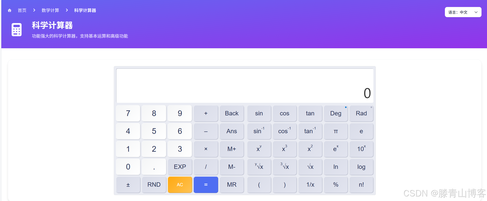

## 工具网址

科学计算器在线工具： [https://see-tool.com/calculator](https://see-tool.com/calculator)

工具截图：

## 工具介绍

计算器使用说明

**基本操作**
鼠标点击网页计算器的[数字键]/[功能键]进行计算
也可通过键盘上的数字键与加减乘除等符号按键进行计算
键盘上的Backspace键，可删除上一个输入的内容
键盘上的回车键Enter，相当于等号，会直接进行计算

**功能键说明**
AC
清除显示区的数字或执行清除常量操作

M+
存储器的数字加上显示区的数字，计算结果并存入存储器中

M-
存储器的数字减去显示区的数字，计算结果并存入存储器中

MR
显示存储器中的数字到显示屏

MC
清除存储器中的记忆的内容

Rad
切换为弧度制（计算三角/反三角时使用）

Deg
切换为角度制

RND
输出大于0，小于1的随机数
