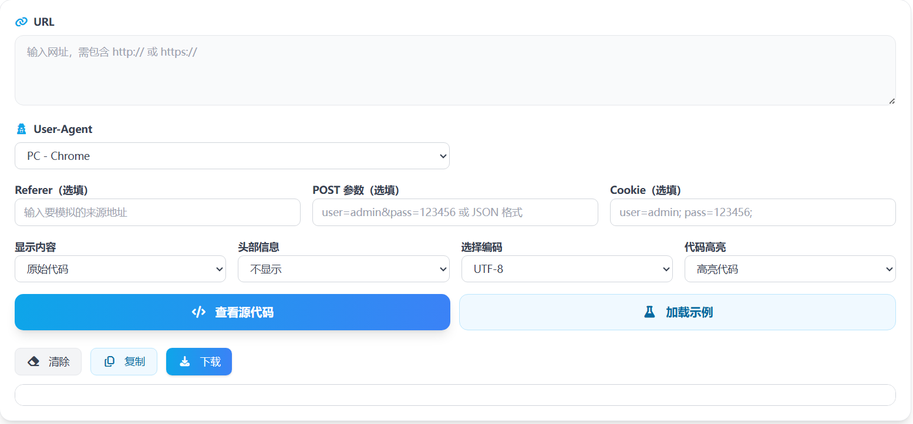

# 网页源代码查看在线工具 核心JS实现

这篇文章只讲本项目里“网页源代码查看”工具的核心 JavaScript 逻辑：用户输入网址后，如何完成参数校验、请求发送、抓取结果处理，以及链接/表单/纯文本提取。

> 在线工具网址：[https://see-tool.com/webpage-source-viewer](https://see-tool.com/webpage-source-viewer)  
> 工具截图：  
> 

## 1）核心状态设计

页面侧用一组响应式状态管理输入、选项和结果：

```js
const urlInput = ref('')
const ua = ref('pc')
const customUa = ref('')
const referer = ref('')
const postData = ref('')
const cookie = ref('')
const contentMode = ref('all') // all | text | form | links
const showHeader = ref('0')
const encoding = ref('UTF-8')
const highlight = ref('yes')
const rawHtml = ref('')
const responseMeta = ref(null)
```

这套状态直接决定了请求参数和最终展示内容。

## 2）入口校验与触发流程

点击“查看源码”后，不会立即发请求，而是先做两件事：

1. 校验 URL 是否是 `http/https`
2. 组装请求前的必要参数

```js
const validateUrl = value => {
  try {
    const target = new URL(value)
    return ['http:', 'https:'].includes(target.protocol)
  } catch {
    return false
  }
}
```

通过入口函数先做校验，可以避免无效请求直接进入抓取流程。

## 3）请求参数组装与发送

请求体不只包含 URL，还会带上 UA、Referer、Cookie、POST 参数、内容模式、编码方式等配置：

```js
const requestBody = {
  url,
  ua,
  uastr,
  referer,
  post,
  cookie,
  text,
  header,
  encoding,
  highlight
}

const response = await fetch('/api/viewhtml', {
  method: 'POST',
  headers: { 'Content-Type': 'application/json' },
  body: JSON.stringify(requestBody)
})
```

这样前端把用户配置完整传给后端，后端按参数执行页面抓取并返回结果。

## 4）抓取逻辑：UA、GET/POST、编码解码

后端抓取核心是三步：

- 按 UA 选项映射为真实 `User-Agent`，支持自定义 UA
- 有 `post` 参数时走 POST；否则走 GET
- POST 内容如果是 JSON 结构就按 JSON 发送，否则按表单字符串发送

拿到响应后，会先读二进制，再按用户选择的编码（UTF-8、GBK、BIG5、ISO-8859-1）解码成文本，最后把状态码和响应头一起返回。

## 5）结果二次处理：源码 / 纯文本 / 表单 / 链接

页面拿到 `rawHtml` 后，通过 `contentMode` 分流：

- `all`：原样展示
- `text`：解析 DOM 后取 `textContent`
- `form`：提取 `form/input/select/textarea/option` 的外层结构
- `links`：提取所有 `a[href]`

实现上是先 `DOMParser` 转文档，再按选择器提取：

```js
const extractLinks = html => {
  const doc = parseHtml(html)
  const links = new Set()
  doc.querySelectorAll('a[href]').forEach(el => {
    const href = el.getAttribute('href')
    if (href) links.add(href)
  })
  return Array.from(links).join('\n')
}
```

如果开启“显示响应头”，会把 `HTTP Status + Headers` 拼到正文前面，便于一起复制保存。

## 6）展示与操作动作

展示区支持代码高亮；当高亮不可用时，走 `escapeHtml` 兜底，避免把内容当成真实标签渲染。工具动作函数包括：

- `copyResult`：优先 `navigator.clipboard`，失败回退 `execCommand('copy')`
- `downloadResult`：按模式导出为 `html` 或 `txt`
- `clearAll`：清空输入和结果状态

这样就形成了完整闭环：输入参数 -> 校验 -> 抓取 -> 提取 -> 高亮展示 -> 复制/下载。
